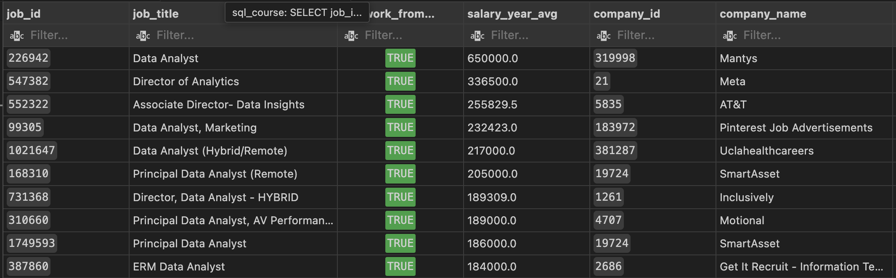
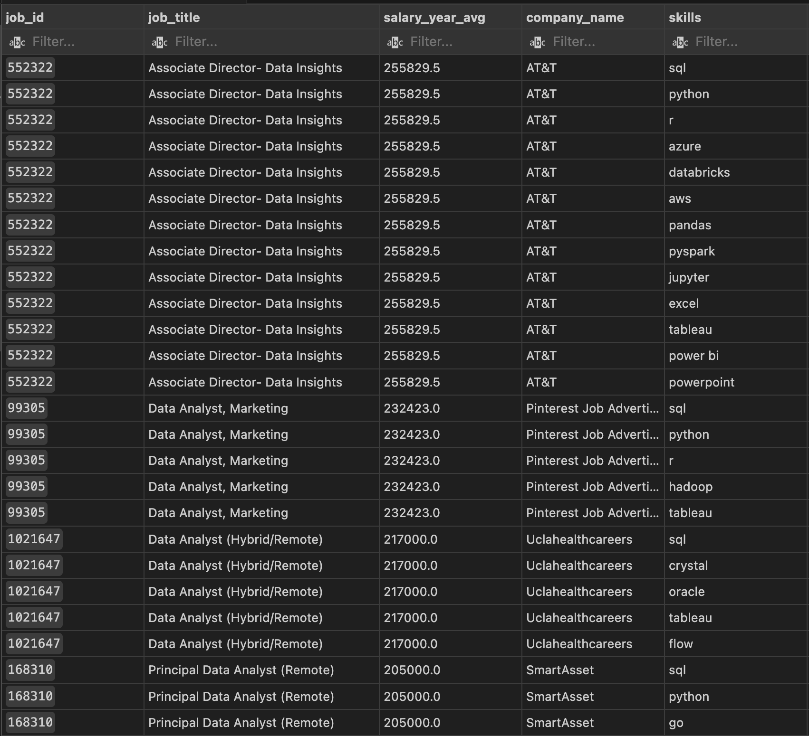
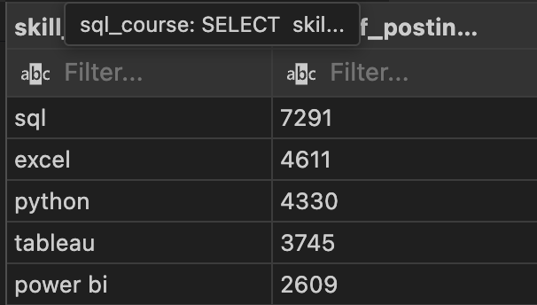
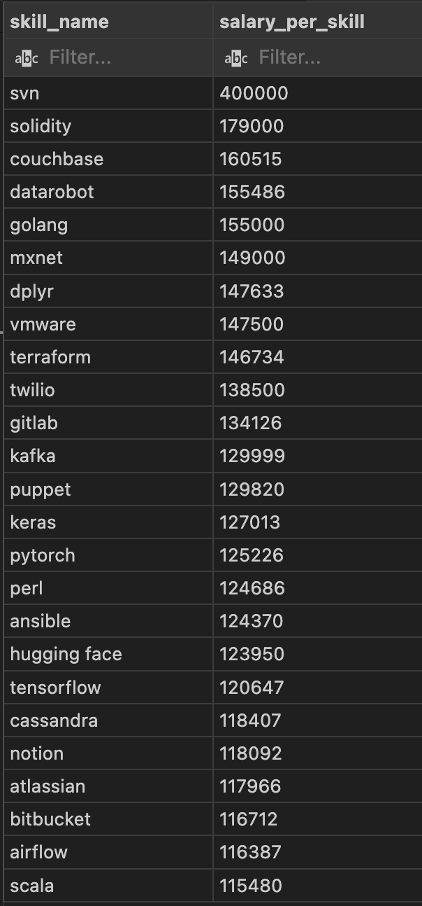
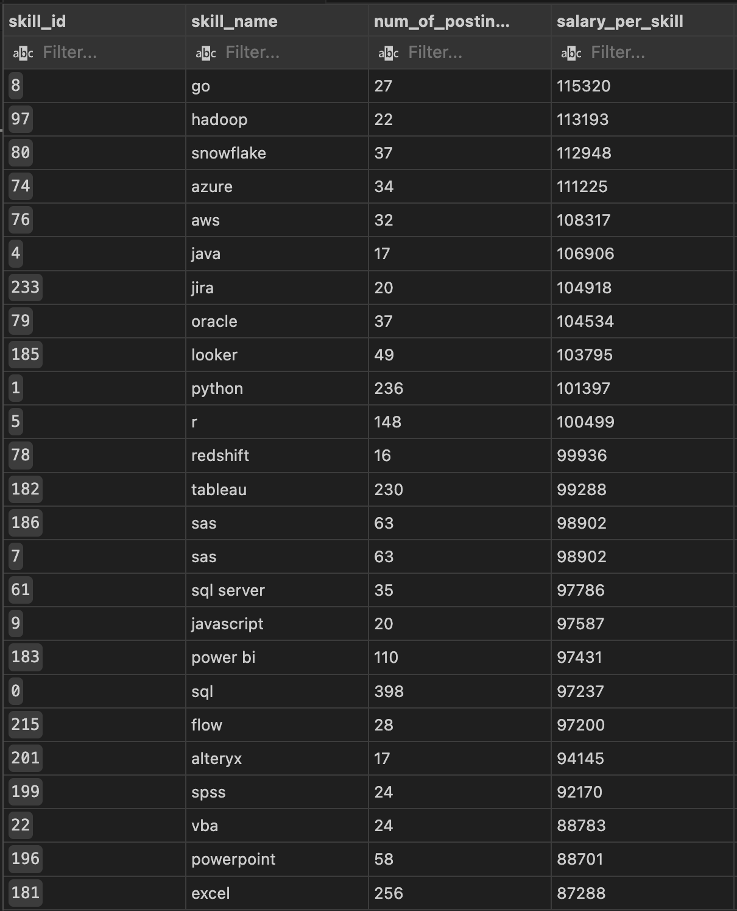

# Analyzing Top-Paying & In-Demand Data Analyst Skills Using SQL

This project explores and analyzes job postings data to identify the most optimal, high-demand, and high-paying roles, skills, and trends for Data Analysts using SQL.
# Introduction 

Hi everyone! Quite recently, I came across a video featuring a few SQL exercises and saw it as a great opportunity to showcase my SQL experience by completing them. The questions were created by **Luke Barousse**, who also provided the database used in this project.


The database consists of  **four** tables:

job_postings_fact

company_dim

skills_dim

skill_job_dim

**Database visualization:**


For more information regarding data types, columns, primary keys, and foreign keys, please check out the following file: [create_tables](/project_sql/sql_load/2_create_tables.sql)


You can access the full database using the following link: - [database](https://drive.google.com/drive/folders/1moeWYoUtUklJO6NJdWo9OV8zWjRn0rjN)


# Queries and result tables:

### 1. Top paying Data Analyst Jobs

The breakdown of the question's sections can be found here - [question 1](/project_sql/1_top_paying_jobs.sql)

```sql
SELECT
    job_id,
    job_title,
    job_location,
    job_schedule_type,
    salary_year_avg,
    job_posted_date,
    job_postings_fact.company_id,
    company_dim.name AS company_name
FROM job_postings_fact
LEFT JOIN company_dim ON company_dim.company_id = job_postings_fact.company_id
WHERE
    job_title_short = 'Data Analyst' AND
    job_location = 'Anywhere' AND
    salary_year_avg IS NOT NULL
ORDER BY
    salary_year_avg DESC
LIMIT 10
```
## Result of the query:



### 2. Top paying job skills for Data Analyst
The breakdown of the question's sections can be found here - [question 2](/project_sql/2_top_paying_job_skill.sql)
``` sql
WITH top_paying_jobs AS
    (SELECT
        job_id,
        job_title,
        salary_year_avg,
        company_dim.name AS company_name
    FROM job_postings_fact
    LEFT JOIN company_dim ON company_dim.company_id = job_postings_fact.company_id
    WHERE
        job_title_short = 'Data Analyst' AND
        job_work_from_home = true AND
        salary_year_avg IS NOT NULL
    ORDER BY
        salary_year_avg DESC
    LIMIT 10)

SELECT
    top_paying_jobs.*,
    skills_dim.skills
FROM top_paying_jobs
    INNER JOIN skills_job_dim ON top_paying_jobs.job_id = skills_job_dim.job_id
    INNER JOIN skills_dim ON skills_job_dim.skill_id = skills_dim.skill_id
ORDER BY
    salary_year_avg DESC 

```

### Result of the query:



### 3. Top demanded skills for Data Analyst

The breakdown of the question's sections can be found here - [question 3](/project_sql/3_top_demanded_skill.sql)
``` sql
SELECT 
    skills_dim.skills AS skill_name,
    COUNT(skills_job_dim.job_id) AS num_of_postings
FROM job_postings_fact
    INNER JOIN skills_job_dim ON job_postings_fact.job_id = skills_job_dim.job_id
    INNER JOIN skills_dim ON skills_job_dim.skill_id = skills_dim.skill_id
WHERE
    job_title_short = 'Data Analyst' AND job_location = 'Anywhere'
GROUP BY
    skills_dim.skills
ORDER BY
    num_of_postings DESC
LIMIT 5
```
### Result of the query:



### 4. Top paying skills for Data Analyst
The breakdown of the question's sections can be found here - [question 4](/project_sql/4_top_paying_skill.sql)

``` sql
SELECT 
    skills_dim.skills AS skill_name,
    ROUND(AVG(job_postings_fact.salary_year_avg),0) AS salary_per_skill
FROM job_postings_fact
    INNER JOIN skills_job_dim ON job_postings_fact.job_id = skills_job_dim.job_id
    INNER JOIN skills_dim ON skills_job_dim.skill_id = skills_dim.skill_id
WHERE
    job_title_short = 'Data Analyst'
    AND job_postings_fact.salary_year_avg IS NOT NULL
    --AND job_location = 'Anywhere'
GROUP BY
    skills_dim.skills
ORDER BY
    salary_per_skill DESC
LIMIT 25
```
### Result of the query:



### 5. Optimal skills for Data Analyst
The breakdown of the question's sections can be found here - [question 5](/project_sql/5_optimal_skills.sql)

``` sql
WITH top_demanded_jobs AS
    (SELECT
        skills_dim.skill_id,
        skills_dim.skills AS skill_name,
        COUNT(skills_job_dim.job_id) AS num_of_postings
    FROM job_postings_fact
        INNER JOIN skills_job_dim ON job_postings_fact.job_id = skills_job_dim.job_id
        INNER JOIN skills_dim ON skills_job_dim.skill_id = skills_dim.skill_id
    WHERE
        job_title_short = 'Data Analyst'
        AND job_postings_fact.salary_year_avg IS NOT NULL
        AND job_work_from_home = True
    GROUP BY
        skills_dim.skill_id),top_paying_jobs AS
    (SELECT
        skills_dim.skill_id,
        skills_dim.skills AS skill_name,
        ROUND(AVG(job_postings_fact.salary_year_avg),0) AS salary_per_skill
    FROM job_postings_fact
        INNER JOIN skills_job_dim ON job_postings_fact.job_id = skills_job_dim.job_id
        INNER JOIN skills_dim ON skills_job_dim.skill_id = skills_dim.skill_id
    WHERE
        job_title_short = 'Data Analyst'
        AND job_postings_fact.salary_year_avg IS NOT NULL
        AND job_work_from_home = True
    GROUP BY
        skills_dim.skill_id)

SELECT
    top_demanded_jobs.skill_id,
    top_demanded_jobs.skill_name,
    top_demanded_jobs.num_of_postings,
    top_paying_jobs.salary_per_skill

FROM top_demanded_jobs
INNER JOIN top_paying_jobs ON top_demanded_jobs.skill_id = top_paying_jobs.skill_id
WHERE
    top_demanded_jobs.num_of_postings > 15
ORDER BY
    top_paying_jobs.salary_per_skill DESC,
    top_demanded_jobs.num_of_postings DESC
LIMIT 25
```
### Result of the query:



## How to Use  
1. Download or clone this repository.  
2. Load the provided SQL schema using the `create_tables` file.  
3. Import the dataset into your SQL environment.  
4. Run the queries from the respective sections in your SQL client.